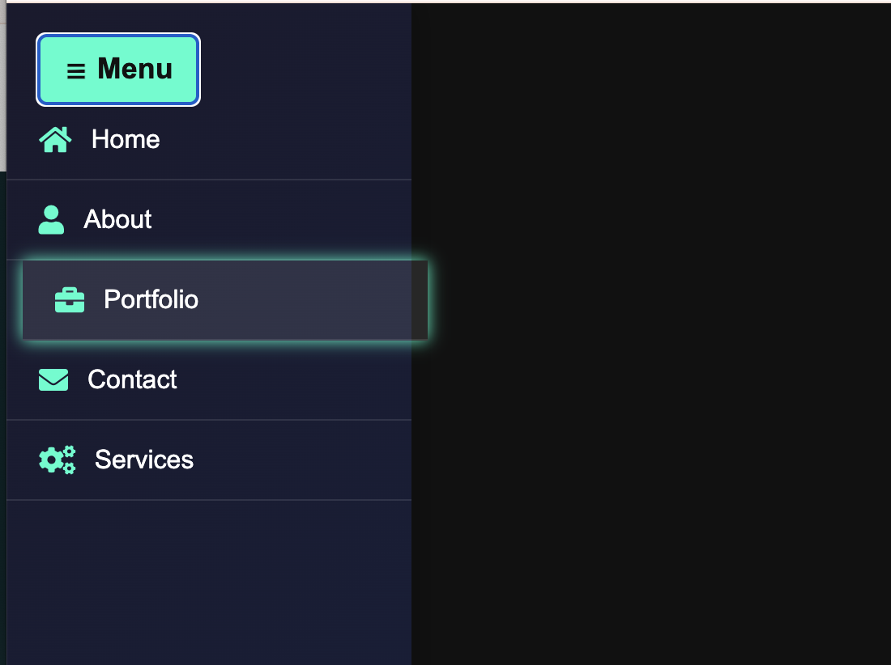

# Day 22 - Stunning Sidebar Menu with Icons  

## 📝 Description  
In this challenge, we built a **stunning sidebar menu** with smooth animations and icons to enhance user experience. This responsive menu can be used on any website to improve navigation while maintaining a sleek and modern design.  

## 🚀 Features  
- **Smooth sliding animation** for opening and closing the menu  
- **Font Awesome icons** for visual appeal  
- **Responsive design**, works on different screen sizes  
- **Hover and active effects** for better interactivity  

---

## 🔧 Technologies Used  
- **HTML5**  
- **CSS3 (Transitions, Animations, Flexbox)**  
- **JavaScript (For toggling the menu)**  

---

# Demo page

Click [Here](https://ayshasanyang.github.io/Day-22-Sidebar-Menu/) to view the page

## 🚀 How to Run
1. Download or clone the repository
```bash
git clone https://github.com/ayshasanyang/Day-22-Sidebar-Menu.git
```
2. Navigate to the project folder.
3. Open the project files in your vscode or any code editor of your choice
4. Open the `index.html` file in your web browser.

---

## 📸 Preview


---
Made with ❤️ by [AYSHA] 🚀